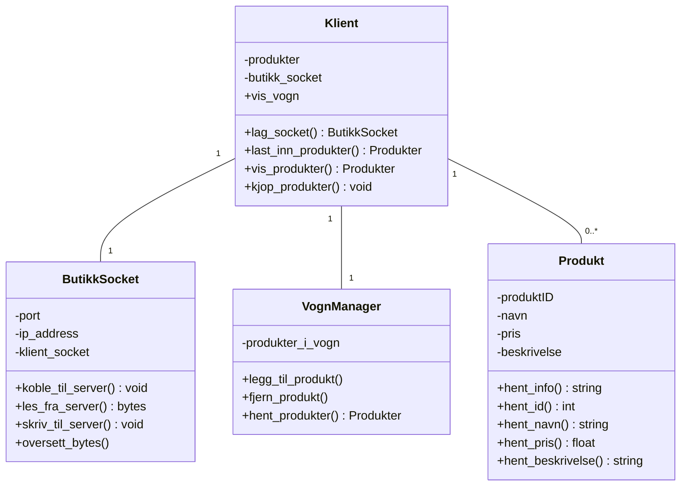

Klient view

Klient kontroll

KLient Modell

```mermaid

classDiagram
    class Klient {
        -produkter
        -butikk_socket
        +lag_socket() ButikkSocket
        +last_inn_produkter() Produkter
        +vis_produkter() Produkter
        +vis_vogn
        +kjop_produkter() void
    }
    class VognManager {
        -produkter_i_vogn
        +legg_til_produkt()
        +fjern_produkt()
        +hent_produkter() Produkter
    }
    class Produkt {
        -produktID
        -navn
        -pris
        -beskrivelse
        +hent_info() string
        +hent_id() int
        +hent_navn() string
        +hent_pris() float
        +hent_beskrivelse() string
    }
    class ButikkSocket {
        -port
        -ip_address
        -klient_socket
        +koble_til_server() void
        +les_fra_server() bytes
        +skriv_til_server() void
        +oversett_bytes()
    }
    Klient "1" -- "1" ButikkSocket    
    Klient "1" -- "1" VognManager    
    Klient "1"--"0..*" Produkt

```
