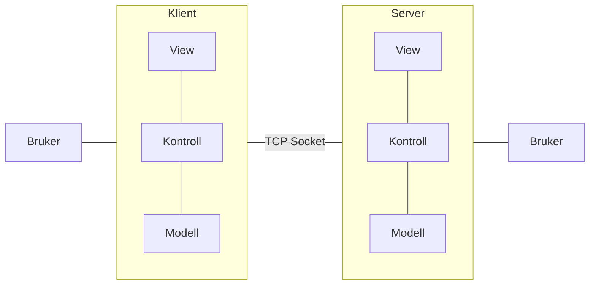
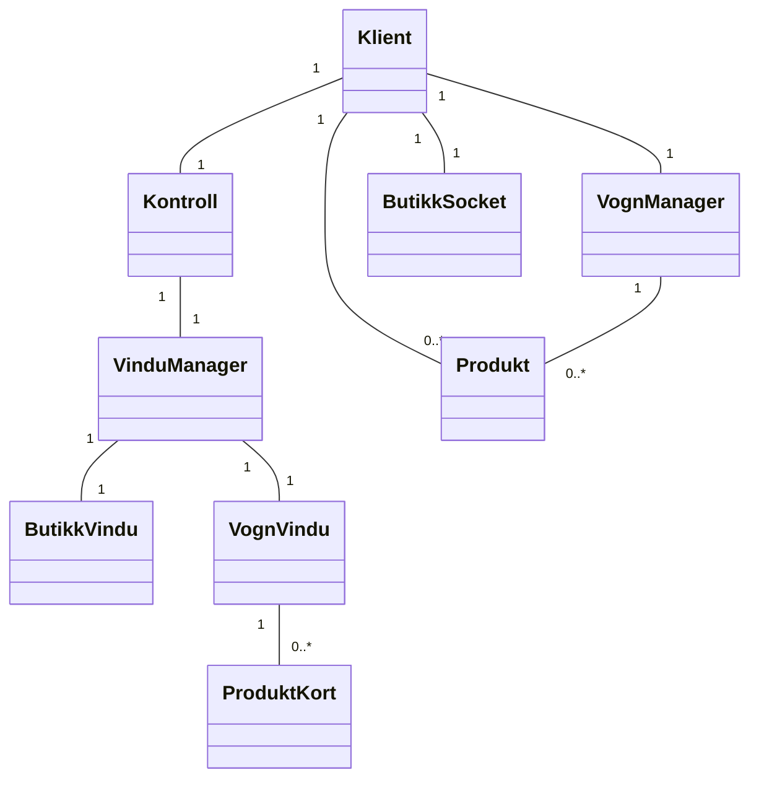

klient og server komponentene bruker model-view-control mønsteret for å tilby grafisk
bruker grensesnitt for bruker. Bruker interagerer med komponent via view, klient og
serveren interagerer via modellen. 

høynivå overordnet arkitektur

Domene modell for hele klient system. Hoved komponentene i modellen er Klient, Kontroll 
og Vindu Manager som kobler til hverandre. Mer beskrivende klassediagram ligger i 
klient.md

