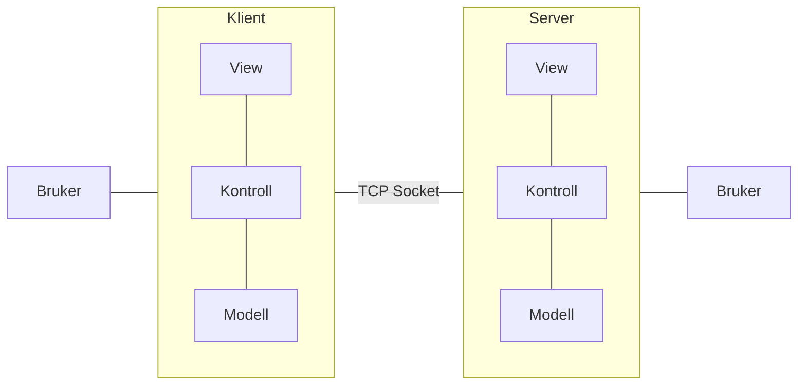

klient og server komponentene bruker model-view-control mønsteret for å tilby grafisk
bruker grensesnitt for bruker. Bruker interagerer med komponent via view, klient og
serveren interagerer via modellen. 

høynivå overordnet arkitektur

