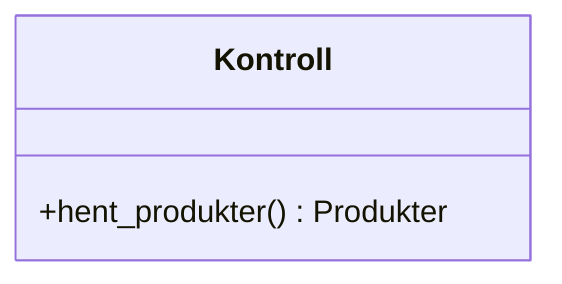
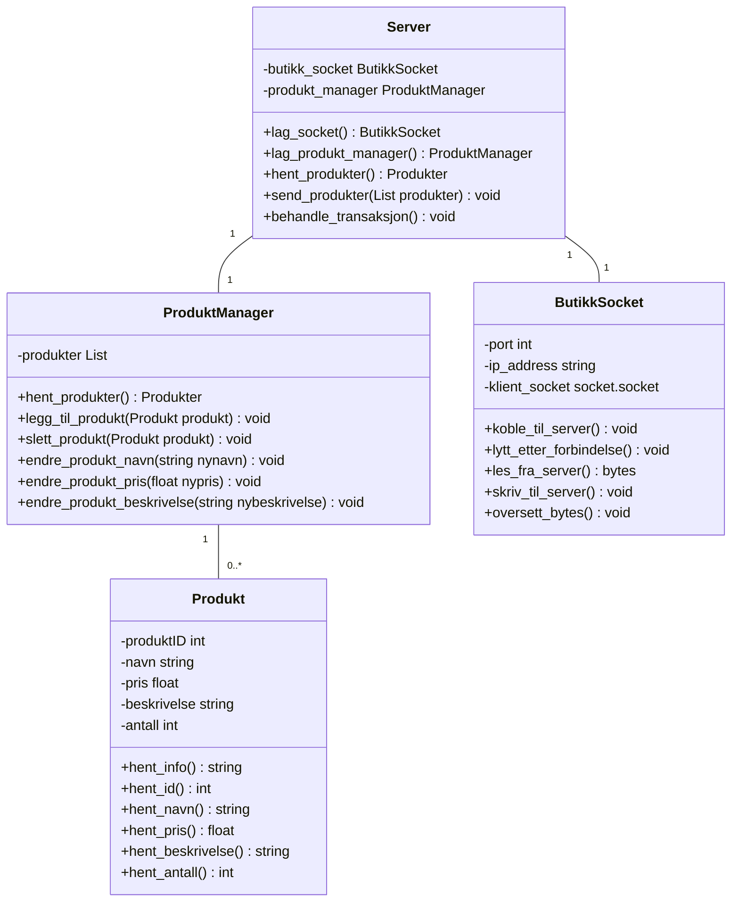

Server view

```mermaid
classDiagram
    class VinduManager {
        -produkt_vindu ProduktVindu
        -rediger_vindu RedigerProduktVindu
        -transaksjons_vindu TransaskjonsVindu
        -detalje_vindu DetaljeVindu
    }
    class ProduktVindu {
        -produkt_korter List<Produkter>
        +oppdater_produkter() void
    }
    class ProduktKort {
        -produkt_id int
        -produkt_navn string
        -produkt_pris float
        -produkt_beskrivelse string
        -produkt_antall int
        +rediger_produkt() void
    }
    class RedigerProduktVindu {
        -produkt_id int
        -produkt_navn string
        -produkt_pris float
        -produkt_beskrivelse string
        -produkt_antall int
        +set_endringer() void
    }
    class TransaksjonsVindu {
        -transaksjon_korter List<TransaksjonsKort>
    }
    class TransaksjonKort {
        -transaksjons_id int
        +vis_detalje() void
    }
    class DetaljeVindu {
        -transaksjons_id int
        -produkter List<Produkter>
        -dato datetime
        -status OrdreStatus
    }
    enum OrdreStatus {
        NY
        BEHANDLES
        SENDT
    }

    
```

Server kontroll



Server modell



