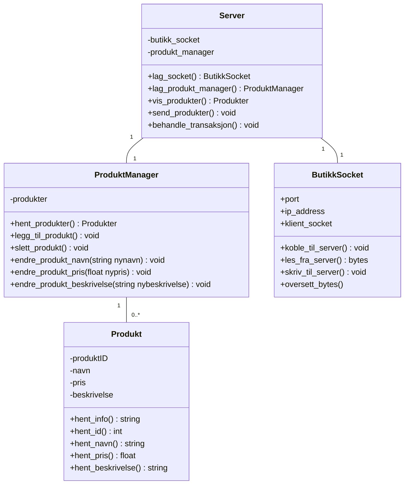

Server view

Server kontroll

Server modell

```mermaid
classDiagram
    class Server {
        -butikk_socket
        -produkt_manager
        +lag_socket() ButikkSocket
        +lag_produkt_manager() ProduktManager
        +vis_produkter() Produkter
        +send_produkter() void
        +behandle_transaksjon() void
    }
    class ProduktManager {
        -produkter
        +hent_produkter() Produkter
        +legg_til_produkt() void
        +slett_produkt() void
        +endre_produkt_navn(string nynavn) void
        +endre_produkt_pris(float nypris) void
        +endre_produkt_beskrivelse(string nybeskrivelse) void
    }
    class Produkt {
        -produktID
        -navn
        -pris
        -beskrivelse
        +hent_info() string
        +hent_id() int
        +hent_navn() string
        +hent_pris() float
        +hent_beskrivelse() string
    }
    class ButikkSocket {
        +port
        +ip_address
        +klient_socket
        +koble_til_server() void
        +les_fra_server() bytes
        +skriv_til_server() void
        +oversett_bytes()
    }
    Server "1"--"1" ButikkSocket    
    Server "1"--"1" ProduktManager
    ProduktManager "1"--"0..*" Produkt
```

